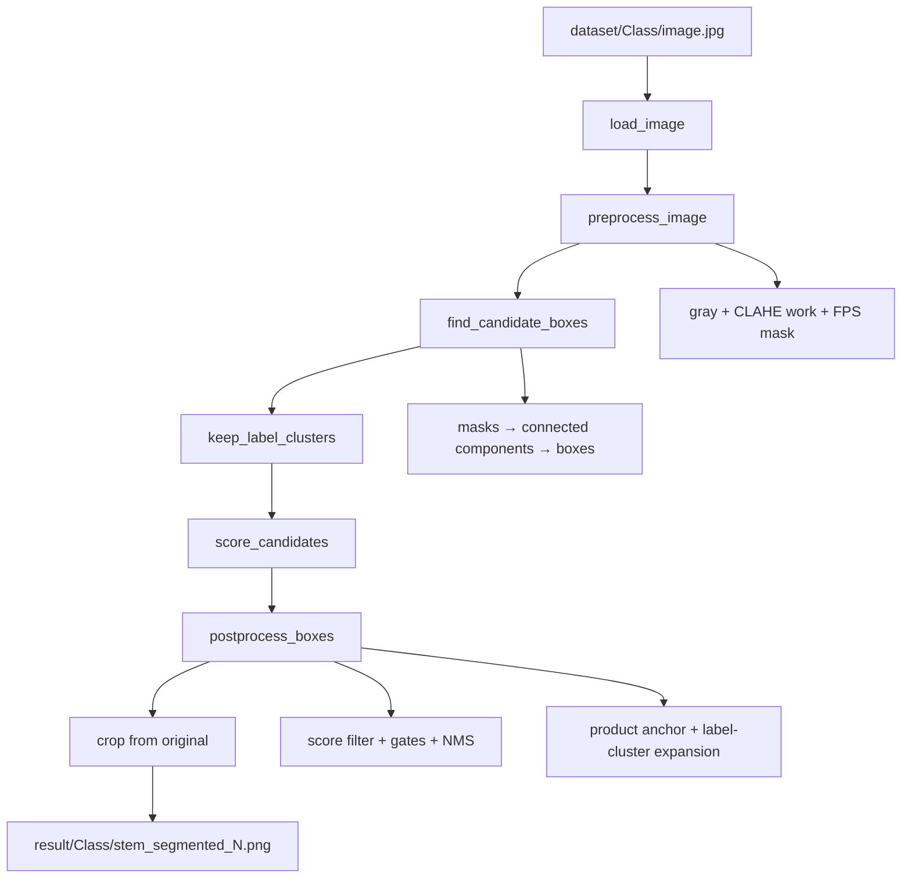

# Detection pipeline — technical reference

This document describes the full **pdiseg** segmentation pipeline: input/output layout, preprocessing, classical computer-vision stages, configuration, and supporting tools. It matches the code under `src/pdiseg/` as of the current repository state.

For the assignment brief see [requirements.md](../requirements.md). For terminology see [CONTEXT.md](../CONTEXT.md).

---

## 1. Goal

Locate a validated **label cluster** on each poultry package frame and write one or more grayscale crops per detection. A final crop must contain product-type label evidence (the **name label**) and may include the adjacent `SUPER FRANGO` brand badge when both are part of the same local package label.

- **No OCR** and **no product classification** from folder names.
- **False positives count as errors** (crops without the product name, or only generic branding).
- Crops are taken from the **original** frame (not the preprocessed work image). See ADR-0003.
- Techniques are limited to **Part 1** classical image processing (thresholding, morphology, filters, histograms). No ML. See ADR-0002.

---

## 2. End-to-end flow



**Per-frame API entry points**

| API | Module | Returns |
|-----|--------|---------|
| `detect_name_labels(image)` | `detection/detector.py` | Final label-cluster boxes only |
| `inspect_detection(image)` | `detection/detector.py` | `DetectionResult` (candidates, kept, scored, labels, work) |
| `inspect_frame(image)` | `detection/detector.py` | `FrameInspection` for overlays |
| `run(dataset, result)` | `runtime/pipeline.py` | Batch write to `result/` |

---

## 3. I/O layer (`pdiseg.io.dataset`)

### 3.1 Dataset layout

```
dataset/                          # or data/Train_and_Validation/
├── 93000064_Coracao/
│   ├── TesteTempoPosicao2025-02-19 13_48_11.950748.jpg
│   └── ...
├── 93000088_Peito_Congelado/
└── ...                           # 18 classes × 50 images
```

- Images are **1280×720 grayscale** industrial camera frames.
- Supported suffixes: `.jpg`, `.jpeg`, `.png` (`IMAGE_SUFFIXES`).
- `*.jpgZone.Identifier` and other non-image files are ignored by `find_source_images`.
- **Class folder names are not used by the detector** — only for organizing output.

### 3.2 Output layout

```
result/
├── 93000064_Coracao/
│   ├── TesteTempoPosicao2025-02-19 13_48_11.950748_segmented_1.png
│   ├── TesteTempoPosicao2025-02-19 13_48_11.950748_segmented_2.png
│   └── ...
└── ...
```

Naming is produced by `segmented_crop_filename(stem, index)` → `{stem}_segmented_{N}.png` (1-based index).

### 3.3 Functions

| Function | Description |
|----------|-------------|
| `find_source_images(root)` | Sorted list of `root/*/*.{jpg,jpeg,png}` |
| `load_image(path)` | `imageio` read → 2-D `uint8` grayscale (first channel if RGB) |
| `list_classes(root)` | Sorted subfolder names |
| `count_images_per_class(root)` | `{class_name: count}` |
| `FPS_OVERLAY_REGION` | `(0, 0, 215, 48)` — burned-in FPS counter top-left |

### 3.4 Batch runner (`pdiseg.runtime.pipeline`)

```text
for each source in find_source_images(input_root):
    image  = load_image(source)
    boxes  = detect_name_labels(image)      # or injected detector
    crop_and_save(image, boxes, output_root, class_name, source)
```

- `crop_and_save` uses `pdiseg.core.imaging.crop` on the **original** `image`.
- Empty box lists produce **no files** for that frame (valid: precision over forcing a crop).
- `process_dataset` returns a `DatasetReport` with per-class frame/crop/empty counts.

---

## 4. Preprocessing (`pdiseg.detection.preprocess`)

`preprocess_image(image, config)` returns `PreprocessResult`:

| Field | Role |
|-------|------|
| `gray` | Original single-channel `uint8` |
| `clahe` | Contrast-enhanced copy |
| `work` | Image used for masks/candidates (CLAHE + FPS masking) |

### 4.1 Steps

1. **Grayscale** — if `ndim > 2`, take channel 0.
2. **Median filter** — `scipy.ndimage.median_filter`, size 3 (salt noise).
3. **CLAHE** — `skimage.exposure.equalize_adapthist`, `clip_limit=0.02`, converted to `uint8`.
4. **FPS overlay masking** — replace `FPS_OVERLAY_REGION` with the median of the CLAHE image so the burned-in counter does not generate false text candidates.

### 4.2 Auxiliary helpers (debug / experiments)

| Function | Purpose |
|----------|---------|
| `preprocess(image)` | Shorthand: returns `.work` only |
| `background_estimate(image, sigma)` | `uniform_filter` low-pass background |
| `shadow_corrected(image, sigma)` | Subtract background, re-center median |

### 4.3 What uses which image

| Stage | Image tensor |
|-------|----------------|
| Mask building (combined, dark, black-hat) | `work` |
| Edge-density mask | `gray` (original contrast) |
| Scoring features (glare, bimodality, bright-on-dark) | **original** `image` inside each box |
| Scoring local text/edge on patch | `work` patch |
| Final crop written to disk | **original** `image` |

---

## 5. Candidate masks (`pdiseg.detection.masks`)

`build_candidate_masks(work, config, gray=...)` returns `CandidateMasks`:

| Mask | Technique | Purpose |
|------|-----------|---------|
| `text_density` | Local mean + offset | Bright text blobs |
| `dark_luma` | Global percentile (`dark_percentile`) | Dark label strips |
| `black_hat` | Morphological black top-hat | Small dark structures on bright plastic |
| `glare` | High percentile threshold | Specular highlights to exclude |
| `combined` | `(text_density \| dark_luma \| black_hat) & ~glare`, morphological close, `clear_border` | Primary candidate generator |
| `edge_density` | Sobel magnitude → windowed density → close/open | Text-like edge groups (optional path into candidates) |

### 5.1 Combined mask pipeline

```text
text_density = work > uniform_filter(work) + text_offset
dark_luma    = work <= percentile(work, dark_percentile)
black_hat    = black_tophat(work) >= percentile(bh, 72)
combined     = (text_density | dark_luma | black_hat) & ~glare_mask
combined     = binary_closing(combined, rectangle(close_v, close_h))
combined     = clear_border(combined, buffer=4% of min(H,W))
```

`clear_border` removes components touching the frame edge (reduces tray-border false positives).

### 5.2 Edge-density mask (`edge_density_mask`)

Used when `gray` is passed into `build_candidate_masks`:

1. Median smooth → Sobel `gx`, `gy` → magnitude threshold (`edge_mag_threshold`).
2. Uniform-filter edge density in a window (`edge_density_window_frac` × width).
3. Keep regions with density > `edge_density_min`.
4. Morphological close then open (`edge_close_size`, `edge_open_size`).

### 5.3 Additional masks

| Mask | Flag | Description |
|------|------|-------------|
| `dog_text_mask` | `use_dog_text=True` (default) | Large-window background subtraction; bright glyphs on locally dark field |
| `dark_body_mask` | `min_body_overlap > 0` | Adaptive local threshold solid-body gate for scoring |

---

## 6. Candidate boxes (`pdiseg.detection.candidates`)

`find_candidate_boxes(work, config, text_source=gray)`:

1. Build masks (`build_candidate_masks`).
2. Run **connected components** (`scipy.ndimage.label` + `find_objects`) on:
   - `masks.combined`
   - `masks.black_hat`
   - `text_density_mask(text_source)`
   - `masks.edge_density` (if present)
   - `masks.dog_text` (if `use_dog_text`)
3. Filter by minimum pixel area (`cluster_min_area_frac`, floor 400 px).
4. Filter by `_area_ok` (fraction of frame, `label_max_area`, max 45% of frame).
5. **Deduplicate** overlapping boxes (`dedupe_boxes`, IoU 0.55).

Output: list of axis-aligned boxes `(x, y, w, h)` in pixel coordinates.

---

## 7. Geometry filter (`keep_label_clusters`)

Before scoring, candidates are filtered by **absolute pixel geometry** (not score):

| Rule | Default |
|------|---------|
| Area | `label_min_area` ≤ `w×h` ≤ `label_max_area` |
| Elongation | `max(w,h)/min(w,h)` ≤ `label_max_elongation` |
| Lateral margin | If `lateral_margin_frac > 0`, reject boxes touching side borders |

If this step removes every box, the pipeline falls back to the raw candidate list.

---

## 8. Scoring (`pdiseg.detection.scoring`)

Each candidate box receives a weighted score in `[0, 1]` plus a `features` dict for debugging and gates.

### 8.1 Feature groups

| Feature | Meaning |
|---------|---------|
| `dark_density` | Fraction of patch darker than global `dark_percentile` on `work` |
| `text_density` | Local contrast text pixels on `work` |
| `edge_density` | Mean Sobel magnitude / 255 |
| `texture` | Patch standard deviation |
| `glare_fraction` | Fraction of glare-mask pixels |
| `contrast` | Ring mean minus inner mean (normalized) |
| `background_level` | Mean of morphologically opened patch (`opened_background`) |
| `bright_on_dark` | Fraction of pixels brighter than opened background + offset |
| `extent` | Otsu foreground fraction on original patch |
| `bimodal_score` | Dark + light class balance and contrast |
| `body_overlap` | Overlap with `dark_body_mask` when enabled, else `dark_density` |
| `position_score` | Favor center-ish, penalize bottom-heavy |
| `area_score`, `aspect_score` | Penalize too small/large or extreme aspect |

### 8.2 Score formula (weights)

```text
score = 0.17·dark + 0.15·text + 0.11·edge + 0.08·texture + 0.09·contrast
      + 0.07·area + 0.05·aspect + 0.05·position + 0.07·background
      + 0.08·bright_on_dark + 0.06·extent + 0.07·bimodal + 0.05·body
      − 0.40·glare
```

Multiplicative penalties/boosts apply for low dark density, high glare, bright patches without dark strip, top-edge slivers, and notebook-style dark-strip matches.

### 8.3 Bimodality helper

`analyze_bimodality(roi, config)` — Otsu split; requires both classes ≥ `bimodality_min_class_frac`; returns contrast × balance score.

---

## 9. Post-processing (`pdiseg.detection.postprocess`)

`postprocess_boxes(image, work, raw_boxes, config)` → `(labels, scored, kept)`.

### 9.1 Product anchor extraction

1. Score raw geometry candidates once with precomputed opened-background/body masks.
2. For each high-ranked candidate, run `refine_to_name_label` internally to extract a product-type anchor.
3. Validate the anchor, not the expanded cluster:
   - strict gate: bright-on-dark product text, dark/opened background, edge density, extent, area, and aspect;
   - relaxed recall gate only after strict search fails: larger minimum area, bimodality/text/edge evidence, bounded extent, and no frame-edge anchors.
4. If no product anchor is found, emit zero crops. There is no largest-dark-component fallback.

### 9.2 Label-cluster expansion

`expand_to_label_cluster(image, work, anchor_box, candidate_pool, config)` expands each validated anchor toward adjacent local label context:

1. Search nearby candidates that are above, upper-diagonal, side-touching, or containing the anchor.
2. Require text/edge/bimodality evidence for context candidates.
3. Merge compatible context while respecting area and scale limits.
4. Prefer context above the anchor so the adjacent brand badge is included when visible.
5. If no context is found, apply directional padding: mostly upward and sideways, modest downward.

### 9.3 Final emission gate

After expansion, the proposed crop is validated again as an emitted label cluster. This gate is intentionally separate from the product-anchor gate:

1. The anchor gate is recall-oriented enough to keep valid narrow or wide product badges.
2. The final cluster gate is precision-oriented: it rejects expanded crops with suspicious area, extreme aspect ratio, weak text/edge evidence, or wide bright-on-light/background context.
3. When the expanded cluster fails but the product anchor is still valid, the pipeline emits a lightly padded anchor instead of the bad expanded crop.
4. If both the expanded crop and the padded anchor fail, the frame emits no crop.

This protects the final `result/` output from plastic glare strips, nutrition-table regions, conveyor noise, and over-expanded brand/context boxes while preserving the product badge that drove the detection.

### 9.4 Final selection

1. Rank detections from anchor score, source candidate score, and expansion bonus.
2. Apply NMS on final cluster boxes.
3. With `primary_cluster_only=True` (default), emit the single strongest validated cluster.
4. Additional clusters are only emitted when `primary_cluster_only=False`, they survive NMS, and their score is close to the top score.

`kept` in `DetectionResult` = selected product anchors (yellow overlay). `labels` = final label-cluster boxes (green overlay).

---

## 10. Detector orchestration (`pdiseg.detection.detector`)

```python
prep     = preprocess_image(image, cfg)
raw      = find_candidate_boxes(prep.work, cfg, text_source=prep.gray)
geometry = keep_label_clusters(raw, cfg, frame_width=image.shape[1])
labels, scored, kept = postprocess_boxes(image, prep.work, geometry or raw, cfg)
```

`detect(image)` is a **test stub** returning the full frame — used only when injecting a fake detector in tests.

---

## 11. Core geometry (`pdiseg.core`)

### 11.1 `imaging.py`

| Symbol | Role |
|--------|------|
| `BBox` | `tuple[int,int,int,int]` — `(x, y, width, height)` |
| `crop(image, bbox)` | NumPy slice |
| `render_overlay(image, inspection)` | RGB overlay: **red** = rejected candidates, **yellow** = kept, **green** = final labels |
| `boxes_to_json` / `inspection_from_json` | Calibration serialization |

### 11.2 `boxes.py`

| Function | Role |
|----------|------|
| `iou`, `non_max_suppression` | Overlap suppression |
| `merge_nearby_boxes` | Merge centers within `distance_frac × diagonal` |
| `dedupe_boxes` | NMS with area as score |
| `clamp_box`, `pad_box` | Boundary safety and crop margin |

---

## 12. Calibration (`pdiseg.calibration.service`)

Not part of graded output — supports manual review.

`calibrate(input_root, output_dir, per_class_limit=3)`:

1. Runs `inspect_frame` on **every** image (full `boxes.json`).
2. Writes up to `per_class_limit` overlay PNGs per class: `{stem}_overlay.png`.
3. Writes `boxes.json` (all frames) and `stats.csv` (per-class candidate/kept/label totals).

See [review-viewer-contract.md](./review-viewer-contract.md).

---

## 13. Review viewer (`pdiseg.review`)

FastAPI app (`pdiseg-review` CLI). Reads `dataset/`, `calibration/boxes.json`, optional `result/` crops. **Does not re-run detection.**

---

## 14. `DetectionConfig` reference

All thresholds live in `detection/config.py` as a frozen dataclass. Defaults are **global** (no per-class tuning).

### 14.1 Selection and caps

| Field | Default | Role |
|-------|---------|------|
| `score_threshold` | 0.48 | Primary score cutoff |
| `score_threshold_fallback` | 0.36 | Relaxed cutoff after final gate |
| `score_relative_min` | 0.58 | `max(threshold, top×relative)` |
| `refine_score_floor` | 0.36 | Min anchor score after internal refine |
| `anchor_search_max_candidates` | 28 | Max ranked candidates to refine per pass |
| `max_labels_per_frame` | 6 | Hard cap per frame |
| `primary_cluster_only` | True | Emit one primary cluster by default |
| `additional_cluster_score_ratio` | 0.92 | Extra-cluster score floor when primary-only is disabled |
| `nms_iou` | 0.30 | NMS IoU threshold |
| `merge_distance_frac` | 0.010 | Legacy nearby merge setting |
| `crop_padding_frac` | 0.04 | Pad before final crop |

### 14.2 Area and shape

| Field | Default |
|-------|---------|
| `min_area_frac` | 0.0008 |
| `max_area_frac` | 0.10 |
| `min_aspect` / `max_aspect` | 0.20 / 5.0 |
| `cluster_min_area_frac` | 0.00045 |
| `label_min_area` / `label_max_area` | 1800 / 160000 |
| `label_max_elongation` | 5.0 |
| `refine_min_fraction` / `refine_max_fraction` | 0.05 / 0.90 |

### 14.3 Masks and preprocessing-related

| Field | Default |
|-------|---------|
| `glare_percentile` | 92.0 |
| `dark_percentile` | 36.0 |
| `text_local_window` | 25 |
| `text_offset` | 14.0 |
| `clear_border_buffer_frac` | 0.04 |
| `edge_mag_threshold` | 55.0 |
| `edge_density_window_frac` | 0.087 |
| `edge_density_min` | 0.19 |
| `edge_close_size` / `edge_open_size` | 21 / 9 |

### 14.4 Scoring / gates

| Field | Default |
|-------|---------|
| `opened_background_size` | 13 |
| `bright_on_dark_offset` | 50.0 |
| `background_level_max` | 114.0 |
| `extent_target` | 0.48 |
| `bimodality_min_class_frac` | 0.30 |
| `use_notebook_gates` | True |
| `gate_min_bright_on_dark` | 0.035 |
| `gate_max_background_level` | 118.0 |
| `gate_min_extent` | 0.40 |
| `gate_min_edge_density` | 0.05 |
| `use_final_product_badge_gate` | True |
| `final_min_bright_on_dark` | 0.040 |
| `final_max_background_level` | 114.0 |
| `final_min_edge_density` | 0.18 |
| `final_min_extent` | 0.45 |
| `final_min_area_frac` / `final_max_area_frac` | 0.0025 / 0.045 |
| `final_min_aspect` / `final_max_aspect` | 0.25 / 4.5 |
| `final_cluster_min_area_frac` / `final_cluster_max_area_frac` | 0.0045 / 0.075 |
| `final_cluster_min_aspect` / `final_cluster_max_aspect` | 0.30 / 3.25 |
| `final_cluster_wide_aspect` | 2.85 |
| `final_cluster_wide_min_bright_on_dark` | 0.030 |
| `final_cluster_wide_max_background_level` | 118.0 |
| `final_cluster_anchor_fallback_min_area_frac` | 0.006 |
| `cluster_expand_up_frac` / `cluster_expand_side_frac` / `cluster_expand_down_frac` | 0.90 / 0.55 / 0.18 |
| `cluster_context_max_gap_frac` | 1.15 |
| `cluster_context_min_axis_overlap` | 0.22 |
| `cluster_context_min_edge_density` | 0.05 |
| `cluster_context_min_bimodal_score` | 0.10 |
| `cluster_context_max_area_scale` | 6.5 |
| `fragment_group_iou` | 0.12 |
| `fragment_group_containment` | 0.55 |
| `fragment_group_gap_frac` | 0.16 |
| `fragment_group_max_scale_ratio` | 3.0 |
| `lateral_margin_frac` | 0.0 |
| `min_body_overlap` | 0.0 |

### 14.5 DoG-style text path

| Field | Default |
|-------|---------|
| `use_dog_text` | True |
| `dog_sigma` | 45.0 |
| `dog_contrast_threshold` | 24.0 |
| `dog_bg_percentile` | 66.0 |
| `dog_bold_size` / `dog_dilate_size` | 3 / 11 |

Pass a custom config to `detect_name_labels(image, DetectionConfig(...))` or `inspect_detection`.

---

## 15. Libraries by stage

| Stage | Primary libraries |
|-------|-------------------|
| Load/save | `imageio` |
| Preprocess | `scipy.ndimage`, `skimage.exposure` |
| Masks | `scipy.ndimage`, `skimage.morphology`, `skimage.segmentation` |
| Components | `scipy.ndimage.label` |
| Scoring | `scipy.ndimage.sobel`, `skimage.filters.threshold_otsu` |
| Refine | `skimage.filters.threshold_otsu`, `scipy.ndimage.label` |

OpenCV is **not** used in the production package (ADR-0002). Reference scripts in the repo root may still use OpenCV for comparison.

---

## 16. Debug and development

| Tool | Location |
|------|----------|
| `debug.ipynb` | Full sample run + stage-by-stage plots |
| `make debug` / `pdiseg-debug` | CLI: one image per class → `debug_result/` |
| `run_debug_sample` | Programmatic sample runner (notebook/CLI) |
| `pdiseg.debug.viz` | `visualize_masks`, `scored_table`, `save_debug_bundle` |
| `dump_preprocessed` | Write CLAHE work images for inspection |
| `make calibrate` + `make review` | Visual QA in browser |

Workflow guides: `.agents/workflows/debug-segmentation.md`, `.agents/workflows/pipeline-change.md`.

---

## 17. Architecture decisions (ADRs)

| ADR | Topic |
|-----|-------|
| [0001](./adr/0001-two-stage-label-detection.md) | Historical cluster detection + name-label refine |
| [0002](./adr/0002-scikit-image-stack.md) | scikit-image/scipy instead of OpenCV |
| [0003](./adr/0003-self-contained-detector-crop-from-original.md) | Crops from original grayscale |
| [0004](./adr/0004-calibration-locked-recall-favoring-thresholds.md) | Calibration/threshold philosophy |
| [0005](./adr/0005-final-output-label-cluster.md) | Final output is validated label cluster |

---

## 18. Related files outside `src/pdiseg/`

| File | Role |
|------|------|
| `reference_segment_label.py` | OpenCV reference implementation |
| `reference_label_segmentation.ipynb` | Exploratory notebook |
| `docker-compose.yml` | Containerized run |
| `Makefile` | `run`, `calibrate`, `review`, `check` |
| `enunciado.pdf` | Original Portuguese assignment PDF |
