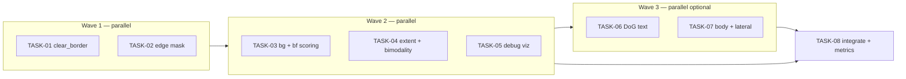

# Tasks: Integrate reference segmentation techniques into `pdiseg`

**Status:** completed (2026-06-14)  
**Created:** 2026-06-14  
**Workflow:** `.agents/workflows/pipeline-change.md`  
**Skill:** `.cursor/skills/pdiseg-pipeline/SKILL.md` (if present)

---

## Executive summary (senior review)

Two reference implementations live at the repository root:

| Artifact | Role |
|----------|------|
| `reference_segment_label.py` | DoG text on dark bg, adaptive dark-body gate, bimodality, 3-attempt relaxation, NMS |
| `reference_label_segmentation.ipynb` | Sobel edge-density, grayscale opening `back` gate, `clear_border`, extent gates, weighted score |

The current `src/pdiseg/` pipeline is **architecturally superior** and **already better tuned** (1707 crops / 900 frames ≈ 1.9 per frame, 0 empty vs legacy 4648 / 53 empty). **Do not replace it wholesale.**

This document splits the integration into **independent tasks** designed for **parallel subagent execution**. Each task has its own prompt, file ownership, and acceptance criteria.

---

## Orchestration — run subagents in parallel

Use the Cursor **Task** tool (`subagent_type: generalPurpose` or `explore` for read-only review) to launch **one subagent per task** within the same wave. Do **not** run tasks that share write ownership on the same file in parallel unless you accept a merge step afterward.

### Execution waves



| Wave | Tasks | Launch together? | Merge risk |
|------|-------|-------------------|------------|
| **1** | TASK-01, TASK-02 | **Yes** — 2 subagents | Low: different functions in `masks.py`; both add `DetectionConfig` fields (merge `config.py`) |
| **2** | TASK-03, TASK-04, TASK-05 | **Yes** — 3 subagents | Medium: TASK-03/04 both touch `scoring.py` — prefer **separate regions** (03 = background features, 04 = extent/bimodality) or run 03+04 sequentially if conflicts arise |
| **3** | TASK-06, TASK-07 | **Yes** — 2 subagents (optional) | Low–medium: different mask modules |
| **4** | TASK-08 | **Single** agent after all prior tasks merged | — |

### How to launch (parent agent)

In **one message**, send multiple `Task` tool calls — one per task in the current wave:

```text
Task(description="TASK-01 clear_border", prompt="<paste TASK-01 prompt block>")
Task(description="TASK-02 edge mask", prompt="<paste TASK-02 prompt block>")
```

After Wave 1 completes, run `make check` (or delegate TASK-08 partial) before Wave 2 if `config.py` / `masks.py` conflicts occurred.

### Shared constraints (all tasks)

- Classical PDI only — OpenCV, scikit-image, scipy, numpy.
- Text density uses `prep.gray`, **not** CLAHE `work`.
- Crops from original frame; `max_labels_per_frame` stays **2**.
- No OCR, no ML, no per-class folder conditionals.
- Committed artifacts in **English**.
- Do **not** modify `reference_segment_label.py` or `reference_label_segmentation.ipynb`.

### Baseline metrics (do not regress)

| Metric | Current target |
|--------|----------------|
| Total crops | ~1707 (±10% OK if precision improves) |
| Avg crops / frame | ~1.9 |
| Empty frames | **0** |
| `make check` | pass, coverage ≥80% |

---

## Gap analysis (shared reference)

### Already covered — skip

Median, FPS mask, morphological grouping, CC labeling, NMS, Otsu refine, fallback, score gap, dual-label cap, original-frame crops. See prior review in git history.

### Mapped to tasks

| Task | Technique | Source |
|------|-----------|--------|
| TASK-01 | `clear_border` on combined mask | Notebook §7 |
| TASK-02 | Sobel edge-density **candidate** mask | Notebook §3–6 |
| TASK-03 | Opening background + `bright_on_dark` | Notebook §4, §9 |
| TASK-04 | Extent/solidity + bimodality score | Notebook §9; script L119–138 |
| TASK-05 | Debug overlays for new masks/features | — |
| TASK-06 | DoG / Gaussian-difference text mask | Script L209–213 |
| TASK-07 | Adaptive dark-body + lateral margin | Script `dark_body_mask`, L258–259 |
| TASK-08 | Metrics, docs, full verification | — |

### Do not port

Monolithic notebook/script replacement; single-box-only output; CLAHE for text; per-class thresholds.

---

## TASK-01 — `clear_border` on candidate mask (P0)

**Status:** completed (2026-06-14)  
**Depends on:** —  
**Parallel with:** TASK-02  
**Owns:** `config.py` (fields `clear_border_*`), `masks.py` (`build_candidate_masks` clear_border step), tests for border rejection

### Scope

1. Add `clear_border_buffer_frac: float = 0.04` to `DetectionConfig`.
2. After morphological closing in `build_candidate_masks`, apply `skimage.segmentation.clear_border` on the **bool** `combined` mask. Buffer size = `int(min(H,W) * clear_border_buffer_frac)`.
3. Unit test: synthetic blob touching border is removed; interior blob kept.

### Acceptance

- [ ] `make check` passes.
- [ ] At least one test asserts border-touching component excluded.

### Subagent prompt

```text
Implement TASK-01 from docs/tasks/integrate-reference-segmentation.md.

Add clear_border to the combined candidate mask in src/pdiseg/detection/masks.py after
binary closing. Add clear_border_buffer_frac to DetectionConfig. Write unit test(s).

Read: .agents/workflows/pipeline-change.md, .agents/constraints.md
Do NOT touch scoring.py, candidates.py edge wiring, or reference files at repo root.
Run make check when done. Summarize files changed.
```

---

## TASK-02 — Sobel edge-density mask channel (P0)

**Status:** completed (2026-06-14)  
**Depends on:** —  
**Parallel with:** TASK-01  
**Owns:** `config.py` (edge-density fields), `masks.py` (`edge_density_mask`), `candidates.py` (wire mask into `find_candidate_boxes`), tests

### Scope

1. Add config fields: `edge_mag_threshold`, `edge_density_window_frac`, `edge_density_min`, morph footprint sizes (or derive from frame).
2. Implement `edge_density_mask(gray, config)` per notebook cell 26:
   - Sobel magnitude → binary (`mag > threshold`, default 55).
   - Local mean via box/uniform filter (window ~35 px or `width // 25`).
   - Threshold density (default > 0.19).
   - Close 21 / open 9 (ellipse; scale with frame if needed).
3. In `find_candidate_boxes`, add `boxes_from_mask(edge_density_mask(text_src, cfg), ...)`.
4. Unit test: synthetic high-edge rectangle yields candidate box.

### Acceptance

- [ ] `make check` passes.
- [ ] Edge mask uses `text_source` / `prep.gray`, not CLAHE work.
- [ ] Test covers edge-density mask → bbox path.

### Subagent prompt

```text
Implement TASK-02 from docs/tasks/integrate-reference-segmentation.md.

Add edge_density_mask() in masks.py and wire it into find_candidate_boxes in
candidates.py. Add DetectionConfig fields for Sobel edge-density thresholds.
Use prep.gray as input (via text_source), not CLAHE work image.

Read: .agents/workflows/pipeline-change.md, reference_label_segmentation.ipynb cell 26 (repo root).
Do NOT implement clear_border (TASK-01) or scoring changes.
Run make check. Summarize files changed.
```

---

## TASK-03 — Scoring: opened background + bright-on-dark (P1)

**Status:** completed (2026-06-14)  
**Depends on:** Wave 1 merged (TASK-01/02 optional but recommended)  
**Parallel with:** TASK-04, TASK-05  
**Owns:** `scoring.py` (background features section only), optional small helper in `preprocess.py` or `masks.py` for `opened_background` cache

### Scope

1. Per frame, compute grayscale opening: `cv2.morphologyEx(gray, MORPH_OPEN, ellipse(13))` — cache once in `score_candidates` or pass via extended preprocess.
2. Per candidate, add features:
   - `background_level` = mean opening inside bbox.
   - `bright_on_dark` = fraction where `gray > opened + offset` (default offset 50, config).
3. Blend into `score_candidate` with soft weights (start ~0.10–0.15 total). Keep score ∈ [0, 1].
4. **Soft only** — no hard gates in this task (TASK-08 may tune).
5. Tests: mock region with dark opening + bright text scores higher than uniform gray patch.

### Acceptance

- [ ] `make check` passes.
- [ ] New features appear in `ScoredCandidate.features` dict.
- [ ] No hard per-class logic.

### Subagent prompt

```text
Implement TASK-03 from docs/tasks/integrate-reference-segmentation.md.

Add background_level and bright_on_dark features to score_candidate in scoring.py.
Use grayscale opening (ellipse 13) on prep.gray. Configurable bright_on_dark offset in
DetectionConfig. Soft weighting only — no hard gates.

Read: .agents/workflows/pipeline-change.md, notebook cell 20 (gate vars back, bf).
Touch ONLY scoring.py and config.py (+ tests). Do NOT edit extent/bimodality (TASK-04).
Run make check. Summarize weight choices.
```

---

## TASK-04 — Scoring: extent + bimodality (P1)

**Status:** completed (2026-06-14)  
**Depends on:** Wave 1 merged  
**Parallel with:** TASK-03, TASK-05  
**Owns:** `scoring.py` (extent + bimodality helpers at module level), `config.py` (bimodality/extent weights)

### Scope

1. Add `extent` = pixel area / bbox area. Obtain pixel area from candidate metadata or approximate via dark pixels in bbox (document choice).
2. Port `analyze_bimodality(roi)` from `reference_segment_label.py` L119–138:
   - Otsu split; reject if minority class < 30%.
   - `score = contrast * (1 - |0.5 - dark_fraction|)`.
3. Normalize bimodality into [0, 1] for composite score; weight ~0.08–0.12.
4. Add `extent_score` — reward extent > ~0.48 (soft Gaussian, not hard gate by default).
5. Unit tests for bimodality helper on synthetic bimodal vs unimodal patches.

### Acceptance

- [ ] `make check` passes.
- [ ] `analyze_bimodality` covered by unit test.
- [ ] Does not break existing synthetic detector tests.

### Subagent prompt

```text
Implement TASK-04 from docs/tasks/integrate-reference-segmentation.md.

Add extent and bimodality features to scoring.py. Port analyze_bimodality from
reference_segment_label.py. Soft weights only. Add unit tests for the bimodality helper.

Read: .agents/workflows/pipeline-change.md, reference_segment_label.py L119-138.
Touch ONLY scoring.py, config.py, tests. Do NOT edit background/bf features (TASK-03).
Run make check. Summarize files changed.
```

---

## TASK-05 — Debug visualization for new masks/features (P1)

**Status:** completed (2026-06-14)  
**Depends on:** TASK-01 and TASK-02 merged (need masks to visualize)  
**Parallel with:** TASK-03, TASK-04  
**Owns:** `src/pdiseg/debug/viz.py`, optional `debug.ipynb` cell notes (minimal)

### Scope

1. Extend debug viz to show: `combined` after clear_border, `edge_density` mask, and new score features (`background_level`, `bright_on_dark`, `extent`, `bimodal_score`) on candidate overlays.
2. Ensure `build_candidate_masks` / inspect API exposes what's needed without circular imports.
3. Smoke test: import viz module; optional test that overlay function runs on synthetic image.

### Acceptance

- [ ] `make check` passes.
- [ ] `debug/viz.py` documents which TASK each panel maps to.

### Subagent prompt

```text
Implement TASK-05 from docs/tasks/integrate-reference-segmentation.md.

Extend src/pdiseg/debug/viz.py to visualize clear_border combined mask, edge_density
mask, and new scoring features on candidate boxes. Read current viz.py and detector
inspect_detection API.

Depends on TASK-01/02 being merged. If masks not yet present, stub with graceful skip.
Run make check. Do not change detection logic — viz only.
```

---

## TASK-06 — Optional DoG text mask (P2)

**Status:** completed (2026-06-14) (optional)  
**Depends on:** Wave 2 complete  
**Parallel with:** TASK-07  
**Owns:** `masks.py` (`dog_text_mask`), `config.py` (`use_dog_text: bool = False`)

### Scope

1. Port DoG-style text from `reference_segment_label.py` L209–213:
   - `bg = GaussianBlur(gray, sigma=config.dog_sigma)`
   - `dark_bg = bg < percentile(bg, pbg)`
   - `text = ((gray - bg) > cT) & dark_bg`
2. Morph open (bold) + dilate/close to group letters.
3. Gate behind `use_dog_text=False` by default; wire into `find_candidate_boxes` when enabled.
4. Test with `use_dog_text=True` on synthetic bright-on-dark text strip.

### Acceptance

- [ ] Default config unchanged (flag off).
- [ ] `make check` passes when flag off and on.

### Subagent prompt

```text
Implement TASK-06 from docs/tasks/integrate-reference-segmentation.md.

Add optional DoG text mask (use_dog_text=False by default) in masks.py, wired in
candidates.py when enabled. Port logic from reference_segment_label.py L209-223.

Run make check. Summarize config defaults.
```

---

## TASK-07 — Adaptive dark-body mask + lateral margin (P2)

**Status:** completed (2026-06-14) (optional)  
**Depends on:** Wave 2 complete  
**Parallel with:** TASK-06  
**Owns:** `masks.py` (`dark_body_mask`), `scoring.py` or `postprocess.py` (`body_overlap` feature), `config.py` (`lateral_margin_frac`)

### Scope

1. Port `dark_body_mask` from script L106–117; expose `body_overlap` = fraction of bbox covered by body mask.
2. Add soft `body_overlap` weight in scoring (or optional hard gate `min_body_overlap` in config, default 0 = off).
3. Add `lateral_margin_frac` — reject candidates with `x < margin` or `x+w > W-margin` in `keep_label_clusters`.
4. Tests for lateral rejection and body overlap computation.

### Acceptance

- [ ] Lateral margin default conservative (e.g. 0.02–0.03 of width) or 0 = disabled.
- [ ] `make check` passes.

### Subagent prompt

```text
Implement TASK-07 from docs/tasks/integrate-reference-segmentation.md.

Port dark_body_mask and body_overlap scoring from reference_segment_label.py. Add optional
lateral_margin_frac filter in keep_label_clusters. Defaults must not regress baseline metrics.

Run make check. Summarize files changed.
```

---

## TASK-08 — Integration, metrics, and docs (final)

**Status:** completed (2026-06-14)  
**Depends on:** TASK-01 through TASK-05 required; TASK-06/07 optional  
**Parallel with:** — (run alone after merge)  
**Owns:** `docs/PIPELINE_IMPROVEMENTS.md`, merge conflict resolution, full-dataset metrics script/run

### Scope

1. Resolve any merge conflicts from parallel tasks.
2. Run `make check`.
3. Run detect-only pass on `data/Train_and_Validation` (900 frames): total crops, avg/frame, empty count.
4. Spot-check 5 frames each from weak classes: `Sassami`, `selado`, `Filezinho` (overlays or crop counts).
5. Update `docs/PIPELINE_IMPROVEMENTS.md` with before/after table.
6. If metrics regress (empty frames > 0 or crops > 2000 without FP improvement), tune `DetectionConfig` minimally and document.
7. Decide whether TASK-06/07 are needed based on metrics.

### Acceptance

- [ ] All global acceptance criteria below met.
- [ ] Summary comment: metrics delta, recommended next steps.

### Subagent prompt

```text
Implement TASK-08 from docs/tasks/integrate-reference-segmentation.md.

Integrate all prior tasks. Run make check. Measure detect-only metrics on full dataset.
Update docs/PIPELINE_IMPROVEMENTS.md. Spot-check weak classes. Tune DetectionConfig only
if needed to preserve 0 empty frames and ~1707±10% crops.

If TASK-06/07 were skipped, state whether they are still recommended.
```

---

## Global acceptance criteria (TASK-08 verifies)

- [x] `make check` passes (ruff, mypy, pytest, coverage ≥80%).
- [x] **0** empty frames on 900-frame detect-only pass.
- [x] Total crops ≤ ~1850 unless review proves major FP reduction (**1775**).
- [x] Each P0/P1 feature has ≥1 unit test (extent covered indirectly via scoring; no isolated extent test).
- [x] No OCR, ML, or class-name conditionals.

Validated 2026-06-26: 900 frames, 1775 crops, avg 1.97/frame, 0 empty.

---

## Reviewer checklist

1. `clear_border` on bool mask **before** `label()`, not after bbox extraction.
2. Edge-density thresholds scale on synthetic small images.
3. TASK-03/04 changes in `scoring.py` compose correctly (weights sum sensibly).
4. Weak classes still get ≥1 crop.
5. Reference scripts at repo root untouched.

---

## Appendix: reference pseudocode

### Notebook edge-density (cell 26)

```python
g = cv2.medianBlur(gray, 3)
gx = cv2.Sobel(g, cv2.CV_32F, 1, 0, ksize=3)
gy = cv2.Sobel(g, cv2.CV_32F, 0, 1, ksize=3)
edens = cv2.boxFilter((cv2.magnitude(gx, gy) > 55).astype(np.float32), -1, (35, 35))
text = (edens > 0.19).astype(np.uint8)
text = cv2.morphologyEx(text, cv2.MORPH_CLOSE, ellipse(21))
text = cv2.morphologyEx(text, cv2.MORPH_OPEN, ellipse(9))
text = clear_border(text)
```

### Script bimodality (L119–138)

```python
thresh = filters.threshold_otsu(roi)
escuros, claros = roi[roi <= thresh], roi[roi > thresh]
if min(len(escuros), len(claros)) / len(roi) < 0.3:
    return 0
contraste = claros.mean() - escuros.mean()
score = contraste * (1 - abs(0.5 - len(escuros) / len(roi)))
```

### Pipeline entry

```python
prep = preprocess_image(image, cfg)
raw = find_candidate_boxes(prep.work, cfg, text_source=prep.gray)
geometry = keep_label_clusters(raw, cfg)
labels, scored, kept = postprocess_boxes(image, prep.work, geometry or raw, cfg)
```
